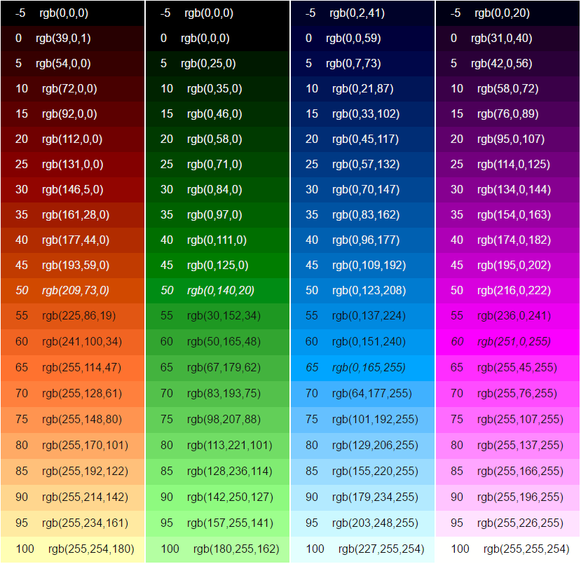

# Glyphr Studio Colors
All colors (that are not user-defined) will come from a set of 4 accent colors, a gray scale, and a special set of failure colors.

### Accent Colors
There will be color gradients specified for 4 accent colors: Orange, Green, Blue, and Purple.

Each gradient is comprised of 19 lightnesses, ranging from l=5 to l=95.  These lightness levels are calculated based on the LAB color space, so lightnesses across hues will be comparable.

The Blue accent color is also the main branding color that shows up on the web page / logo / etc.

### Gray scale
Gray scale is actually a cool gray scale in 20 lightnesses, ranging from l=5 to l=95, plus an 'off white'.  There is no pure black or white.

### Failure Colors
A dark / medium / light set of Red colors will be specified for failures, and used only to indicate a bad state.  The dark variant should be dark enough to be used for text.

# Color Examples
