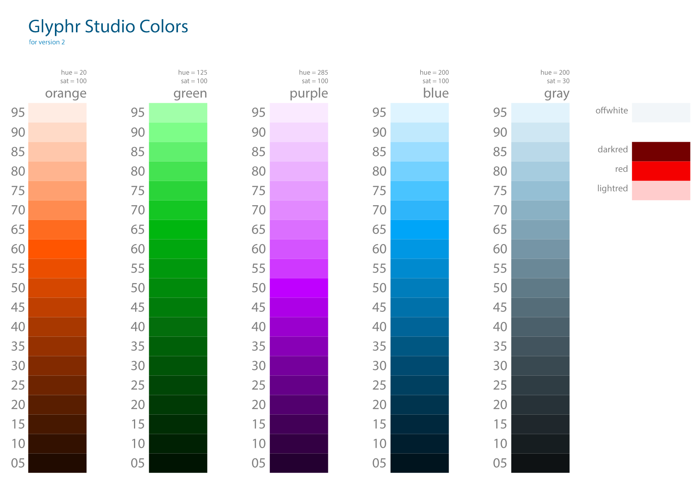

# Colors
## Spec Status: Final for Beta 1
All colors (that are not user-defined) will come from a set of 4 accent colors, a gray scale, and a special set of failure colors.

## Using Colors
Wherever possible, colors will be specified by variable, referencing a centralized definition file... something like:

```
colors.purple.l65
```

This will make color design updates easier in the future.  It will also enable possible theming functionality - either user defined, or page themes.  Possibly something like:

```
var themecolor = colors.blue;
div.style.backgroundColor = themecolor.l85;
```
## Descriptions
### Accent Colors
There will be color gradients specified for 4 accent colors: Orange, Green, Blue, and Purple.

Each gradient is comprised of 19 lightnesses, ranging from l=5 to l=95.  These gradients track a single Hue in the HSB color space.
The lightness levels are calculated based on the LAB color space, so lightnesses across hues will be comparable.

The Blue accent color is also the main branding color that shows up on the web page / logo / etc.

### Black and White
For all UI elements and design, colors as defined in the official list will be the only colors used - so the darkest color will be Gray Lightness = 05, and the lightest color will be Offwhite.

**The only notable exception** being glyph designs and their backgrounds.  Glyphs will be black, and the backgrounds they sit on will be white.  This applies to the Edit Canvas, as well as things like glyph preview thumbnails.

### Gray scale
Gray scale is actually a cool gray scale in 20 lightnesses, ranging from l=5 to l=95, plus an 'off white'.

### Failure Colors
A dark / medium / light set of Red colors will be specified for failures, and used only to indicate a bad state.  The dark variant should be dark enough to be used for text.


## Color Reference
