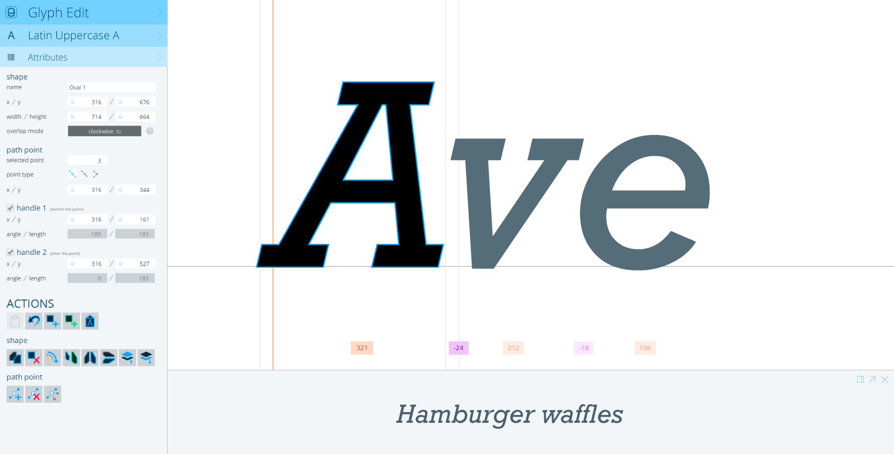
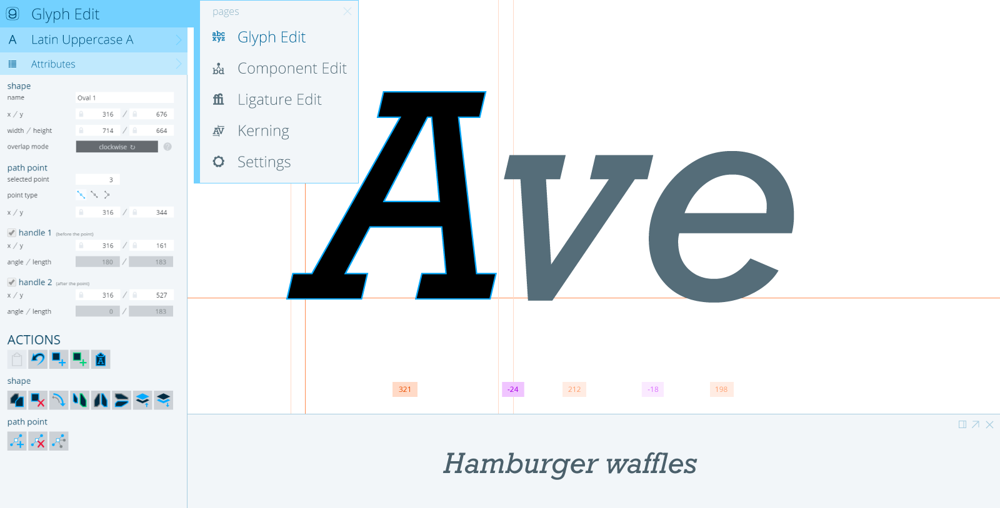
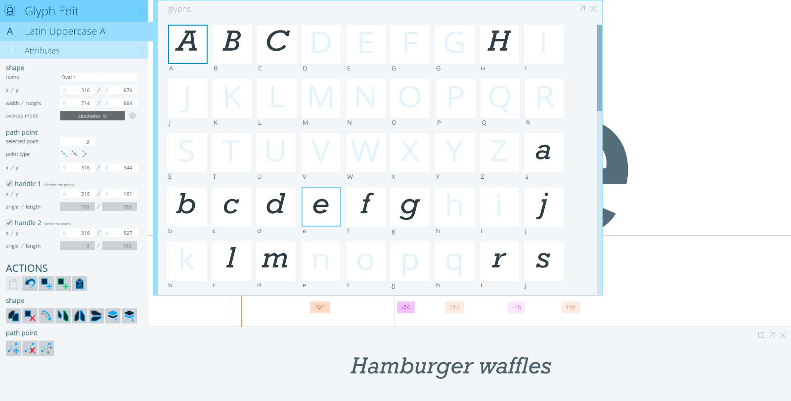
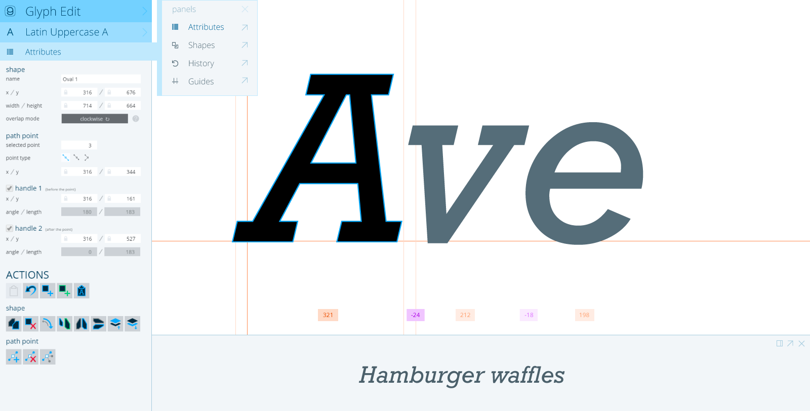

# Information Architecture
## Spec Status: Final for Beta 1

The IA of a product is what pages exist, how the information is divided among them, and now navigation happens between them.

Besides the Open Project page, navigation will be presented via titles / buttons in the upper left hand corner of the screen.
There will one to three options: Page / Glyph / Panel, Page / Panel, or just Page.  When one of these items is pressed, a list of available 
pages, glyphs, or panels will be displayed, allowing for navigation or in-page option selecting.

Here are the names of the pages in Glyphr Studio
*Pages marked with (B1) are planned for Beta 1

* Open Project (B1)
* Glyph Edit (B1)
* Component Edit
* Ligature Edit
* Spacing
* Kerning
* Settings (B1)
	* Font Metadata
	* Key Metrics
	* Glyph Ranges
	* (Other sections as necessary...)
	* Project / UI Options
	* Help
	* About

### Open Project
This is the page that the user first encounters.  It contains some sort of awesome Glyphr Studio graphic, Version information, and a variety of ways to start a new project (From scratch, load from a project file, load from a font file, load an example).

There is no way to navigate back to the Open Project page once a project is open.

### Glyph, Component, and Ligature Edit
These are the main glyph editing areas of the product.  Even though they are separated into three pages, **these pages are functionally identical**.  They all just edit glyphs.  Since our target audience is novice / hobbyist typeface designers, this artificial split helps people understand what is possible, and how a font could be organized.

### Spacing
This will be a multi-glyph workspace that allows for editing side bearings.  Context, or preview functionality, should exist at word, sentence, and paragraph scale.

### Kerning
On this page a user will be able to define a Kern Pair, containing either two single glyphs, or two classes of glyphs to kern.

### Settings
The settings page will be broken down into a set of sections that are scoped to a single logical area.

### Help
Help will be a link to an external doc site.

#Mockups
Light Theme

