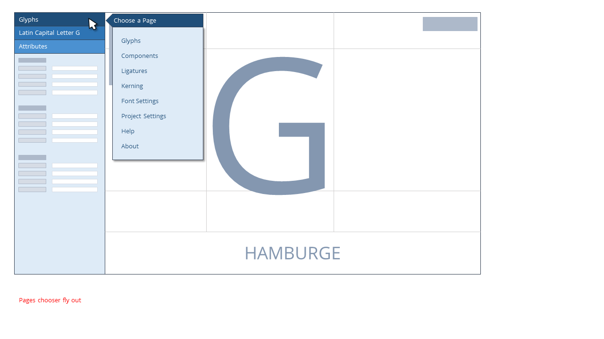
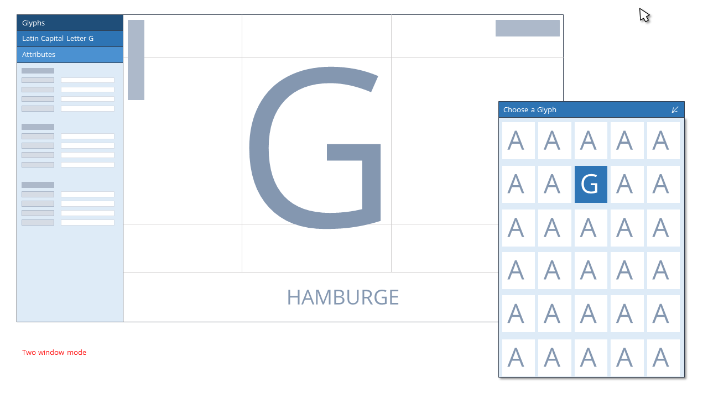
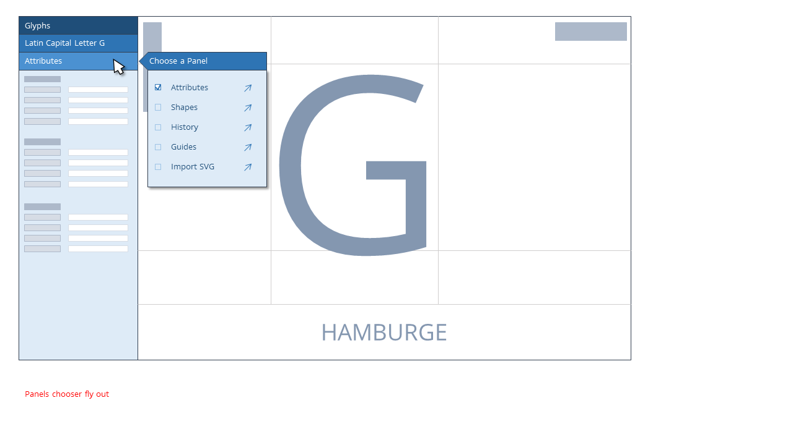
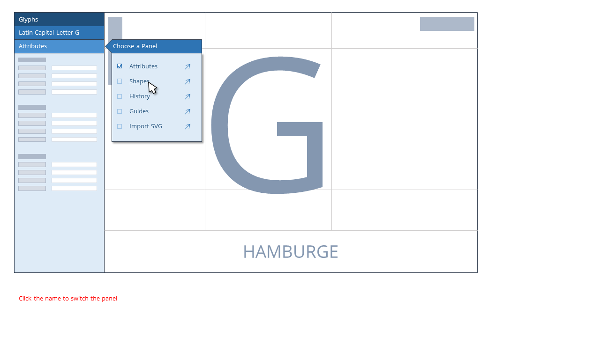
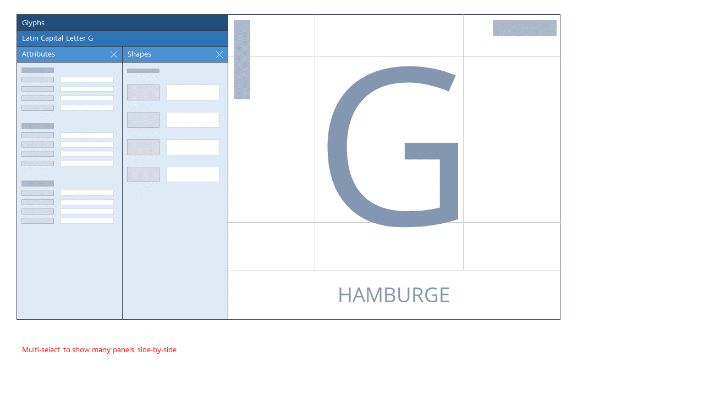
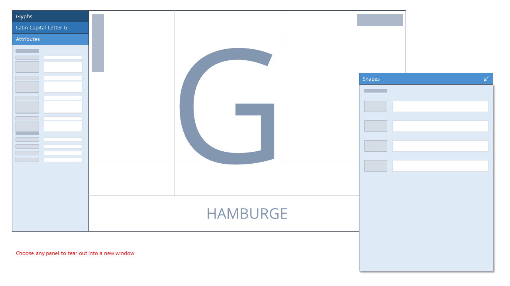
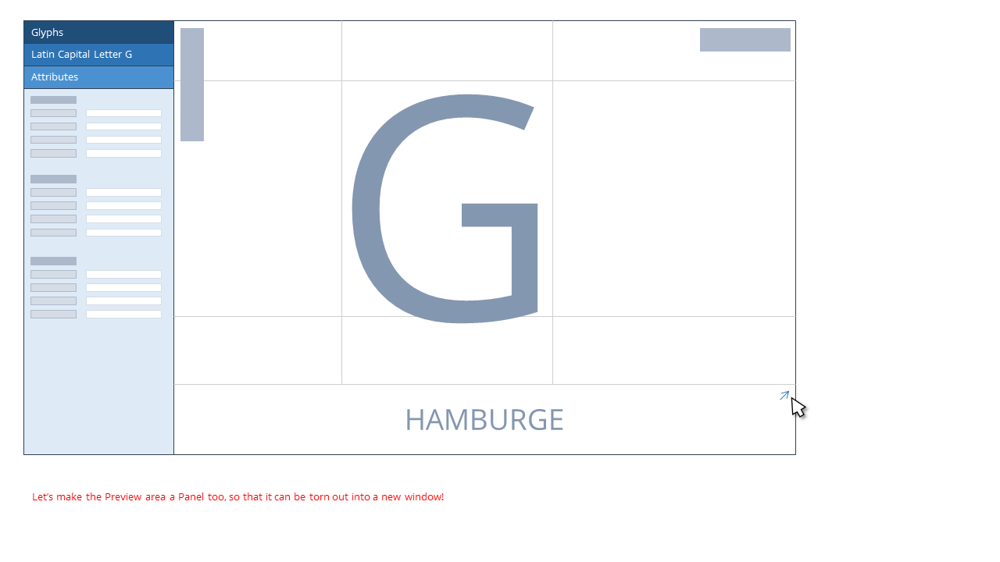
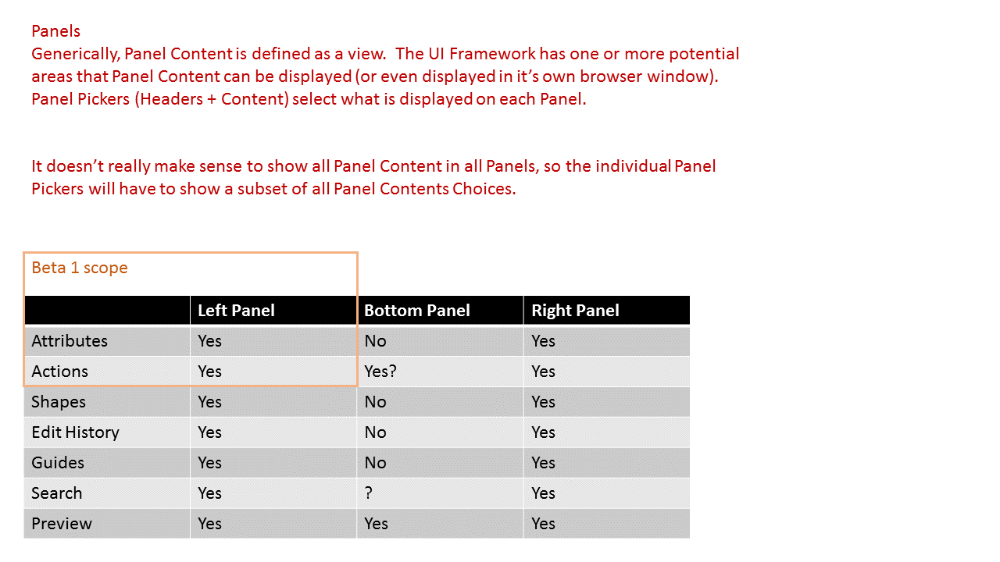
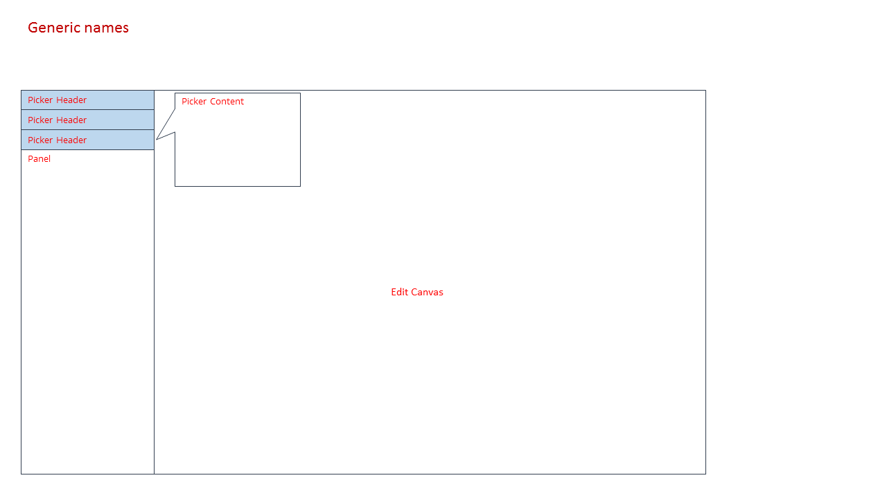
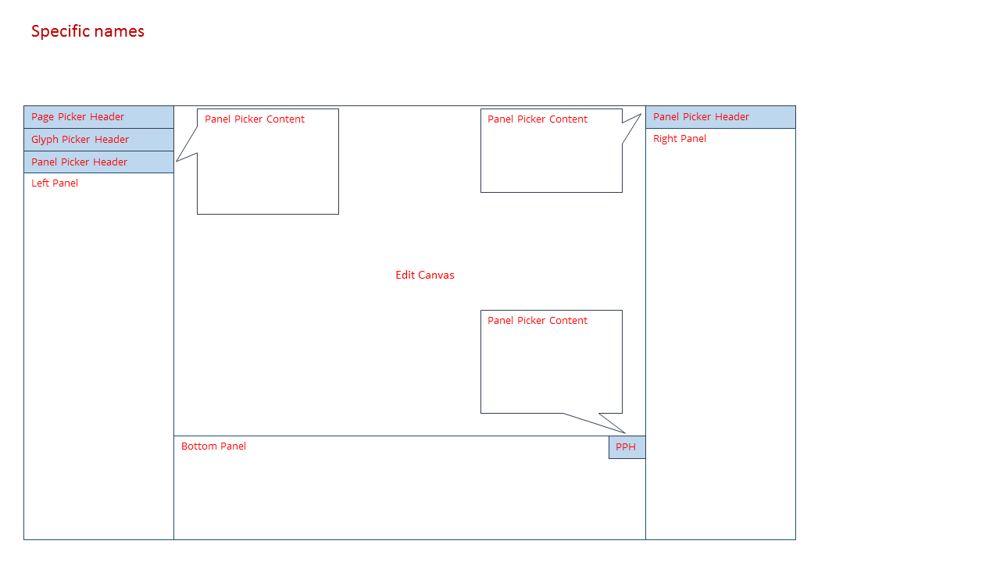

# Panels
At a high level, navigation happens between pages, and within a page, different sub-views are contained within a Panel.  In V1, the main panel toggling happened between the Attributes / Shapes / History / Guides / Glyphs panels.  A large problem with V1 was that it was hard to view many Panels at the same time, so to speak.  And even some crucial funcitonality, like previewing sentence or paragraph scale text, was on a totally different page.

V2 re-thinks and expands the roles of Panels.  Mostly, we should make it easy to create a panel that offers some valuable view into the current Glyph, or the whole typeface.  Additionally, you should be able to 'tear out' any panel into a separate window.  In addition to 'tearing out' panels into a new window, it may be helpful to think of a method to show many panels within a single window, for laptop / single screen users.  This could be optimized, or even capped, at 2-3 panel viewing.

With these two high level functionality points in mind, v2 revamped Panels will make it easy to achieve a more traditional typeface development workflow.

# Low-fi walk through

